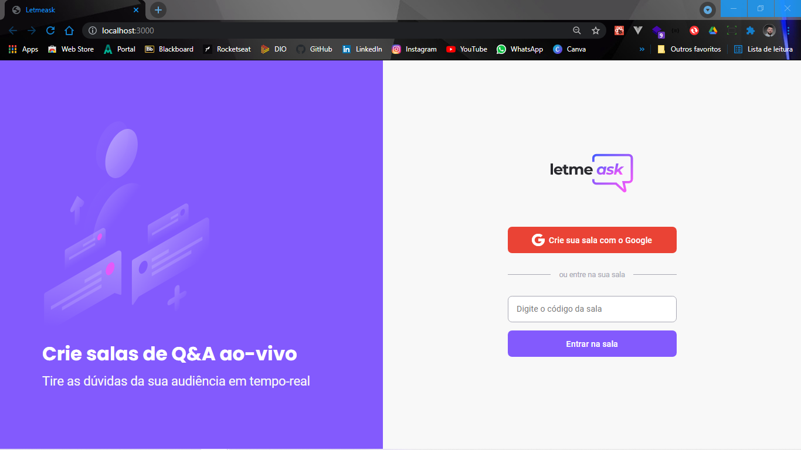

<p align="center">
  
</p>

<br>

<p align="center">
    <kbd></kbd>
</p>

<p align="center">
 <a href="#-about-the-project">About the project</a> •
 <a href="#-technologies">Technologies</a> •
 <a href="#-getting-started">Getting started</a> •
 <a href="#-license">License</a>
</p>

<br>

## 📚 About the project

The project consists in an application that can help content creators to get questions to their stream with a ranking system based on upvotes. They can integrate a Twitch channel to get questions via channel chat if the message contains the hashtag #letmeask.

## 🧪 Technologies

This project was developed using the following technologies:

- [React](https://reactjs.org)
- [Firebase](https://firebase.google.com/)
- [TypeScript](https://www.typescriptlang.org/)
- [MobX](https://mobx.js.org)
- [Material-UI](https://material-ui.com)
- [Tmi.js](https://tmijs.com/)

## 🚀 Getting started

Clone the project and access the folder.

```bash
$ git clone https://github.com/Lucianobarretto/letmeask.git
$ cd letmeask
```

Follow the steps below:

```bash
# Install the dependencies
$ yarn

# Start the project
$ yarn start
```

The app will be available for access on your browser at http://localhost:3000

## 🔖 Layout

You can view the project layout through the links below:

- [Layout Web](https://www.figma.com/file/u0BQK8rCf2KgzcukdRRCWh/Letmeask/duplicate)

Remembering that you need to have a [Figma](http://figma.com/) account to access it.

## 📝 License

This project is licensed under the MIT License. See the LICENSE file for details.

<br>

<p align="center">  
  <a href="https://github.com/Lucianobarretto/letmeask/blob/master/LICENSE.md">
    
  </a>
</p>

---

<p align="center">
  
</p>

<p align="center">  
  <a href="https://www.linkedin.com/in/lucianobalmeida/">
    
  </a>  
</p>
